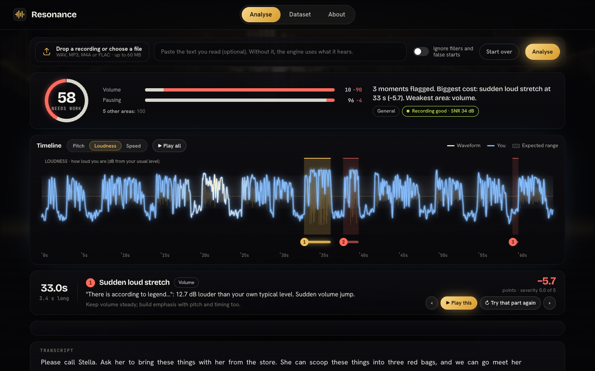

<!-- BRAND:start -->
# Resonance

**Detect. Explain. Improve.**
<!-- BRAND:end -->

Speech delivery analytics built on the Flawline benchmark (Track C: Contrastive Speech Analytics & Temporal Flaw Grounding).

<!-- LINKS:start -->
[Dataset download](https://drive.google.com/drive/folders/1HUwjgzhGVNBPQMHhGchfYjcXd-iLGn8T?usp=sharing) · [Technical report (PDF)](docs/technical_report.pdf) · [Datasheet](DATASHEET.md)
<!-- LINKS:end -->



## What it does

- Upload a recording of someone reading aloud, with the text if you have it.
- Flagged moments appear on a timeline with exact start and end times.
- Each moment comes with a plain-language cause, the points it cost and a coaching tip.
- **Try that part again** records a retake of one phrase and compares it with the first attempt on the measurement behind the flag.
- Download a report with the score, every flagged moment, its explanation and its tip.

Accent, voice and recording conditions are not scored: noise, a phone line, room echo and compression are covered by invariance tests (see [`docs/RESULTS.md`](docs/RESULTS.md)).

## Quick start

Requirements: Python 3.13 (tested with 3.13.1) and `ffmpeg`.

```bash
make setup                     # pinned dependencies (requirements.lock) and the spaCy model
# download the Flawline dataset (link above), then:
unzip -o flawline-v1.0.zip -d flawline-dataset
make app                       # http://localhost:8501  (Analyse, Dataset, About)
```

Docker: the image holds the code and dependencies; mount the unzipped dataset.

```bash
docker build -t resonance .
docker run -p 8501:8501 -v "$PWD/flawline-dataset:/app/flawline-dataset" resonance
```

To rebuild the dataset instead of downloading it: `make baselines dataset` (fetches VCTK and the JFK excerpts, aligns them, generates every clip).

## The Flawline benchmark

563 clips, about 10 hours: 10 baseline recordings (8 VCTK speakers and 2 excerpts of the 1962 Rice University address), 15 flaws at 5 levels each, and 6 recording conditions. Every flaw is injected at a known place and strength, so every label is ground truth. Splits hold out speakers (train, dev, test; the two JFK excerpts form a separate evaluation set).

| Area | Flaws (code) |
|---|---|
| Pacing | Rushed phrase (PACE_FAST), Dragging (PACE_SLOW) |
| Pausing | Misplaced pause (PAUSE_BAD), Missing pause (PAUSE_LOST) |
| Intonation | Flat pitch (MONOTONE), Rise on a statement (UPTALK), Buried emphasis (EMPH_FLAT) |
| Volume | Trailing off (FADE), Sudden loud stretch (SHOUT) |
| Fluency | Filler (FILLER), False start (REPEAT), Hesitation before a hard word (RARE_HESIT) |
| Clarity | Slurred consonants (SLUR) |
| Text fidelity | Skipped word (WORD_SKIP), Misread word (WORD_SWAP) |

Label format: [`schema/label.schema.json`](schema/label.schema.json) (v1.1.0), example in [`schema/example.label.json`](schema/example.label.json). Datasheet: [`DATASHEET.md`](DATASHEET.md). Licences: [`flawline-dataset/LICENSES.md`](flawline-dataset/LICENSES.md).

## How it works

Ingest → quality gate → alignment → detectors → arbitration → severity → rubric score → explanation. The generator that writes the benchmark and the engine that reads it never import each other.

Each of the 7 areas scores `100 · exp(−points lost / 35)`; the overall score is `0.6 × weighted mean of the areas + 0.4 × weakest area`, so one badly hurt area cannot hide behind an average. Weights depend on the kind of speaking (interpretive reading, declamation, extemporaneous, persuasive oratory) and are listed in [`engine/rubric.yaml`](engine/rubric.yaml).

Two modes:
- **With a clean reading of the same text** (most accurate): the engine compares the recording with the clean reading.
- **Upload mode** (no reference): the engine uses the transcript, the speaker's own clip and norms from clean speakers. It is less accurate and covers fewer flaw types.

## Results

Event F1 against the injected flaws, 11 headline flaws, thresholds fitted on train only.

| Same-speaker mode | F1 (IoU ≥ 0.5) | F1 (IoU ≥ 0.3) | Median onset error | Area accuracy |
|---|---|---|---|---|
| Train (235 clips) | 0.611 | 0.670 | 17.5 ms | 98% |
| Dev (20 clips) | 0.659 | 0.729 | 29.5 ms | 100% |
| JFK 1962 (160 clips) | 0.551 | 0.607 | 26.1 ms | 96% |

Upload mode (5 detectable flaws): F1 0.363 on train, 0.412 on dev, 0.116 on JFK 1962.

- The score falls with flaw level for 12 of 13 scored flaws (Spearman ρ ≤ −0.9).
- False flags on unaltered speech under noise, phone, room, MP3 and gain: 0.45 per minute.
- Worst score shift of an unaltered reading under those conditions: 6.5 points.

The test split (B05, B08) is held out and has not been evaluated; no number here comes from it.

Every metric, split, acceptance test and leakage-audit result, with how it was measured: [`docs/RESULTS.md`](docs/RESULTS.md).

## Limitations

- Upload mode is weaker than the reference mode and does not transfer to noisy archival speech.
- Skipped words are detected only when a clean reading of the text is available.
- Four flaws (buried emphasis, false start, rise on a statement, hesitation before a hard word) are experimental and excluded from the headline numbers.
- The speaker pool is small (8 voices aged 18 to 38, read speech).
- Realism of the injected flaws was checked by one listener.

## Deliverables

| Requirement | Where |
|---|---|
| Dataset, datasheet, licences | Dataset download (link above); [`DATASHEET.md`](DATASHEET.md); [`flawline-dataset/LICENSES.md`](flawline-dataset/LICENSES.md) |
| Dashboard: upload, feature extraction, visual and text output | `make app`: Analyse, Dataset, About pages ([`app/`](app/)) |
| Temporal flaw grounding | Start and end of every flagged moment; metrics in [`docs/RESULTS.md`](docs/RESULTS.md) |
| Causal explanations | Cause, points lost and coaching tip per moment ([`engine/explain.py`](engine/explain.py)) |
| Technical report (6 pages) | [`docs/technical_report.pdf`](docs/technical_report.pdf) |
| Demo video | Submitted with the hackathon entry |
| Reproducibility | `make` targets, `Dockerfile`, [`requirements.lock`](requirements.lock), [`flawline-dataset/checksums.sha256`](flawline-dataset/checksums.sha256) |

## Repository layout

```
app/                web app: FastAPI service and static front end
engine/             analysis engine: alignment, detectors, scoring, explanations, rubric
eval/               metrics, acceptance tests, leakage audit, headline evaluation
flawline-dataset/   generator/, baselines/, manifest.csv, checksums (audio is distributed separately)
dashboard/          lab pages (Streamlit)
schema/             label schema and validator
docs/               RESULTS.md, technical report, screenshots
scripts/            helpers (brand, results document, listening-study clip set)
```

## Developer tools

- `make lab`: lab pages for the dataset (alterations review, baselines, pilot gate).
- `make label` and `make review`: listening-study tools (labelling page and flag review). Built; not used for any reported result.
- `make eval`: harness self-test, acceptance tests, leakage audit, and headline metrics on train and dev (never the test split).

## Acknowledgements and licence

- VCTK 0.92: Veaux, Yamagishi and MacDonald (2017), University of Edinburgh, CC BY 4.0.
- President Kennedy's 1962 address at Rice University: John F. Kennedy Presidential Library and Rice University recording, public domain.
- Libraries: faster-whisper, spaCy, Praat via parselmouth, librosa, FastAPI.

Code: MIT ([`LICENSE`](LICENSE)). Data keeps its own licences ([`flawline-dataset/LICENSES.md`](flawline-dataset/LICENSES.md)).
