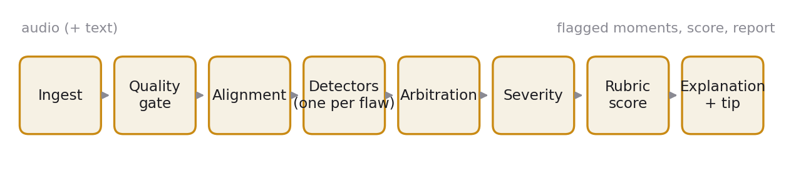
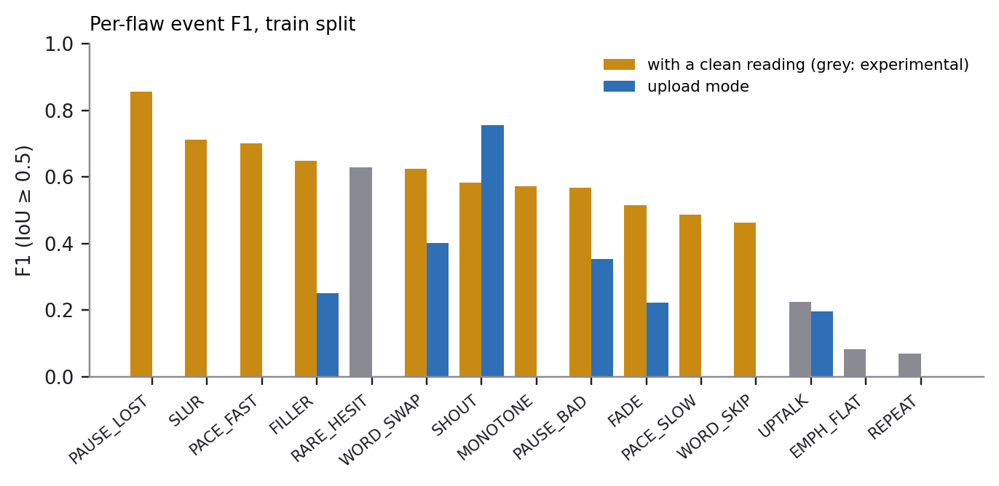
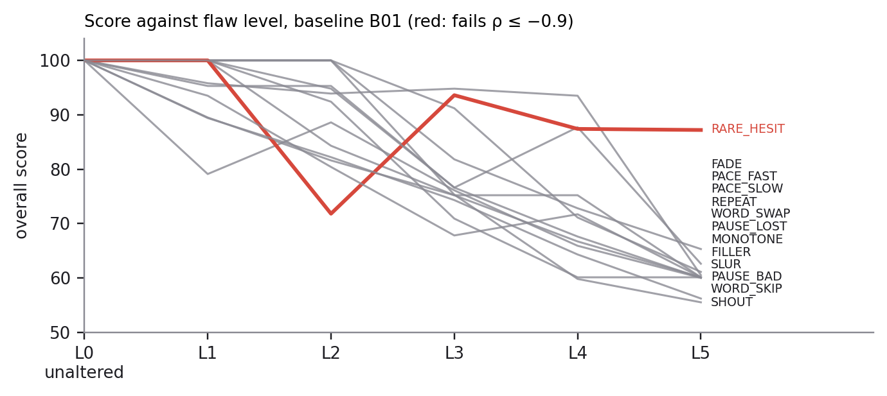
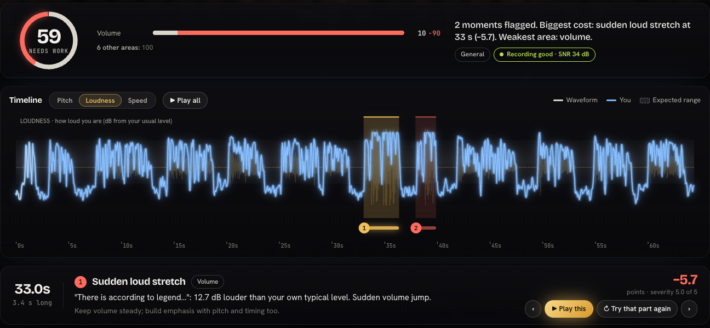

# Resonance and the Flawline benchmark: locating and scoring delivery flaws in read speech

Track C: Contrastive Speech Analytics & Temporal Flaw Grounding. All numbers are produced by the code in this repository and are listed, with how they were measured, in `docs/RESULTS.md`.

## 1. Problem

A speaker practising a reading wants to know *where* delivery goes wrong and *why*, not only a single score. Judging delivery needs a yardstick, and human ratings are costly and inconsistent. We build the yardstick the other way round: real recordings of speakers reading a known text are altered at known places and strengths with controlled delivery flaws, so every label is ground truth by construction. An engine then predicts the same labels blind, and an evaluation harness compares prediction with truth. The dataset (the **Flawline benchmark**), the generator, the engine (**Resonance**) and the harness share one label format (`schema/label.schema.json`, v1.1.0). The generator and the engine never import each other, so the engine cannot read the answer from the code that wrote it.

*Figure 1. Pipeline from audio and optional text to flagged moments, score and report.*

## 2. The Flawline benchmark

**Who.** Ten baseline recordings: eight VCTK 0.92 speakers (CC BY 4.0; studio read speech, ages 18 to 38; American, New England American, English, Irish, Australian, South African and two Indian-English voices) and two roughly one-minute excerpts of President Kennedy's 1962 address at Rice University (public domain; open-air recording with crowd noise). Splits hold out speakers: test (B05, B08) is run once at the end, dev is B03, train is B01, B02, B04, B06 and B07, and the two JFK excerpts form a separate set that no threshold was fitted on.

**Where.** Each baseline also appears under six synthetic recording conditions: babble noise at 20 dB, pink noise at 10 dB, room reverb (RT60 0.6 s), a 300 to 3400 Hz phone band, 64 kbps MP3 and a gain change. Conditions are applied to unaltered readings (they must not change the score) and to a sample of flawed readings (they must not remove the flags).

**What.** Fifteen flaws in seven categories, five levels each (L1 mild to L5 egregious): pacing (rushed, dragging), pausing (pause inside a phrase, missing pause), intonation (flat pitch, rise on a statement, buried emphasis), volume (trailing off, sudden loud stretch), fluency (filler sounds, false starts, hesitation before a hard word), clarity (slurred consonants) and text fidelity (skipped words, misread words). The release has 563 clips (9.96 hours): 405 single-flaw, 50 multi-flaw, 38 flawed clips under a recording condition and 70 unaltered or condition-only clips.

**Placement and rendering.** The generator works from the transcript. Word times come from forced matching of a recogniser's word timestamps to the known text, then every cut is moved to the nearest energy valley. A grammar pass types each word boundary (sentence end, clause punctuation, before a conjunction, inside a tight phrase), so pauses and fillers are placed where a real speaker would or would not put them. Pace changes are confined to a short stretch with a ramp (PSOLA time-scaling), fades and loud stretches use smooth gain curves, fillers are recorded hesitation sounds (the speaker's own where available) inserted with a natural gap, and skipped words are removed at silent boundaries with a short crossfade.

**Quality gates.** (i) *Objective checks* on every clip: the labelled region sits where the audio changed, the flaw strength grows with level, and edit boundaries fall on word boundaries within tolerance. (ii) *Removal gate:* after a word is cut, the recogniser is run again on the seconds around the join; if it still hears the removed word, the clip is rejected and the word is blacklisted for that take. On the first pass 10 of 81 removals failed; after three rounds of rejecting and regenerating, none of the 81 is audible by this gate. The gate and the skipped-word detector use the same recogniser (faster-whisper, base.en), so the gate guarantees the word is not *heard*, not that a detector can *notice* its absence. (iii) *Leakage audit:* a classifier that sees only editing artifacts (click energy at the join, noise-floor step, spectral-flux spike, sample-exact repetition) tries to tell an altered window from the same place in the clean baseline. Trained on the train split and scored on held-out windows it reaches AUC 0.591 (pass mark 0.60); leave-one-speaker-out gives 0.612. Five flaws exceed 0.65 in the leave-one-speaker-out analysis (Section 6).

## 3. Engine

The engine takes audio and, optionally, the text that was read, and returns flagged regions (flaw, area, start and end time, severity 0 to 5, cause) and a score. It has two modes that differ only in how "expected delivery" is obtained.

**With a clean reading of the same text.** (1) *Condition matching:* the reference is degraded to the recording's measured bandwidth, noise and reverb, so the recording condition cannot pass for delivery. (2) *Alignment:* dynamic time warping on log-mel features with deltas; the lag between recording and reference is read as events (a sharp rise is an insertion, a fall a deletion) and as tempo (its slope over about 1.5 s). (3) *Detectors:* one per flaw, each a threshold on a speaker-normalised measurement: pauses and fillers from lag events, skipped words from deletions, misread words from a local path cost, pace from tempo, flat pitch from F0 range, trailing off, loud stretches and slurring from level and 2 to 7.5 kHz energy. Thresholds are fitted on train by coordinate search.

**Upload mode (no reference).** Expectations come from the clip's own statistics (level, F0 range), transcript rules (pause norms by boundary type, recogniser output against the text for misread words and fillers) and norms from clean speakers. Five flaws are detectable this way (trailing off, loud stretch, pause in the wrong place, filler sounds, misread words); localised pace changes, slurring, flat pitch and skipped words are not, because without a reference there is nothing to compare a short stretch with. Skipped-word detection from the text alone was measured and rejected (precision 0.07, recall 0.16 on train).

**Shared stages.** *Arbitration* drops known secondary symptoms inside a primary region (short pauses inside a rushed stretch, a loud stretch also looking "prominent") and resolves other overlaps in favour of the more reliable detector (reliability is precision on train). *Severity* is an isotonic map from the measured deviation to the injected level, fitted on train. *Explanation* fills one template per flaw with the measured numbers and the words concerned, and adds a coaching tip.

## 4. Scoring

Each flagged region costs `p = w · c · r · s² · m`: a per-flaw weight `w`, recording-quality confidence `c`, detector reliability `r`, severity `s` and a duration factor `m` (1 for events, region seconds / 2 capped at 3 for spans). The penalty per clip minute `P` gives an area score `100 · exp(−P / 35)`. The overall score is `0.6 × (genre-weighted mean of the seven areas) + 0.4 × (weakest area)`, so one badly hurt area cannot hide behind an average; the band (polished, strong, noticeable flaws, needs work) is capped by the weakest area. Weights per area depend on the kind of speaking (interpretive reading, declamation, extemporaneous, persuasive oratory) and can be replaced by a user rubric. The per-flaw weights are fitted on train single-flaw clips so a single level-5 flaw scores about 60 for every flaw type. In a recording whose quality gate is fair or poor, or whose conditions differ from the reference, a lone flag in an area counts half and cannot be the weakest area, which stops one stray detection from dominating the score.

## 5. Evaluation protocol

*Grounding.* A predicted region matches a true flaw of the same type when their overlap (IoU) is at least 0.5 (strict) or 0.3 (standard); point-like events are widened to 0.30 s. We also report onset F1 (same type, start within 250 ms), the median onset error and the share of located flags that name the right area. *Score acceptance tests.* Dose-response: the score must fall with level (Spearman ρ ≤ −0.9) on the B01 grid of all five levels. Invariance: unaltered readings under each condition must keep their score (target shift below 3 points) and produce at most 0.5 false flags per minute. Locality: a flaw should cost points mainly in its own area (target below 2 points elsewhere). *Leakage* is described in Section 2. Thresholds, weights and maps are fitted on train; dev is checked; the JFK set is never fitted on; the test split is run once.

## 6. Results

| Same-speaker mode | Clips | F1 (IoU ≥ 0.5) | F1 (IoU ≥ 0.3) | Onset F1 | Median onset error | Area accuracy |
|---|---|---|---|---|---|---|
| Train | 235 | 0.611 | 0.670 | 0.580 | 17.5 ms | 98% |
| Dev | 20 | 0.659 | 0.729 | 0.541 | 29.5 ms | 100% |
| JFK 1962 | 160 | 0.551 | 0.607 | 0.528 | 26.1 ms | 96% |

*Table 1. Eleven headline flaws, with a clean reading of the same text.* In upload mode (five detectable flaws) the strict F1 is 0.351 on train, 0.375 on dev (6 of 23 flaws found) and 0.095 on JFK 1962, where recogniser errors on the noisy recording produce many false flags (794 flags for 199 true flaws).

*Figure 2. Per-flaw event F1 on the train split, with a clean reading (left bars) and in upload mode (right bars).*

Four flaws are experimental and excluded from the headline numbers: buried emphasis (F1 0.08; the voices are too flat for flattening to scale with level), repeated words (0.07), rise on a statement (0.22) and hesitation before a hard word (0.63, but its score does not fall steadily with level and its leakage AUC is 0.69 to 0.72).

*Figure 3. Overall score against flaw level on the B01 grid; one line per scored flaw.*

*Dose-response.* The score falls steadily with level for 12 of 13 scored flaws (Figure 3); hesitation before a hard word fails (ρ = −0.64). *Invariance.* Under noise, phone band, room reverb, MP3 and gain change, unaltered readings raise 0.45 false flags per minute (target ≤ 0.5, met); the worst score shift is 6.5 points (target < 3, not met), the mean shift is 0.0 to 1.6 points per condition. *Locality.* A level-3 flaw costs 6.1 points in other areas on average (target < 2, not met). *Leakage.* Overall AUC 0.591 held out, 0.612 leave-one-speaker-out; FILLER (0.69), PAUSE_BAD (0.71), PAUSE_LOST (0.72), RARE_HESIT (0.72) and REPEAT (0.74) exceed 0.65 in the latter, so part of their detectability may come from editing traces.

*Figure 4. The analysis view: score, flagged moments on the loudness trace, the cause and the points lost.*

## 7. Fairness and invariance

Accent, voice, speaker and recording condition are not scored: the reference is degraded to the recording's conditions, the measurements are normalised per speaker, and the invariance suite above checks that conditions do not move the score. The benchmark supports no claim about accents or demographics (one or two speakers per accent). The score is a rubric measuring departure from a chosen yardstick, not a verdict on a speaker: a flat voice, an accent, a stammer or a deliberate pause is not a fault in itself. The fluency switch and the custom rubric exist for that reason, and low-quality recordings carry a lower confidence.

## 8. Limitations

Upload mode is weaker than the reference mode and does not transfer to noisy archival speech. Skipped words need a clean reading. Four flaws are experimental, and two acceptance targets (worst score shift, locality) are not met. The speaker pool is small (eight voices aged 18 to 38, read speech, no spontaneous speech, slang, children or speakers over 45). Realism of the injected flaws was checked by one listener; the objective checks do not replace a listening study. Dev is a single speaker, so dev numbers are noisy. Rebuilding the audio on another platform can change a few time-stretched clips by one 16-bit step, so the released archive ships the baseline takes and checksums.

## 9. Future work

A gold set labelled by speaking coaches, to replace injected flaws with human judgement as the main yardstick (the listening-study tools, `make label` and `make review`, are already built and the engine-versus-listener comparison script exists); coaching text from a language model grounded in the measured numbers; Indian English and code-mixed speech, in the reference and the upload modes; and a reference-free route to skipped words.

## Reproducing

`make setup`, unzip the released dataset into `flawline-dataset/` (or `make baselines dataset`), `make eval`, `make app`; Docker instructions are in the README.
