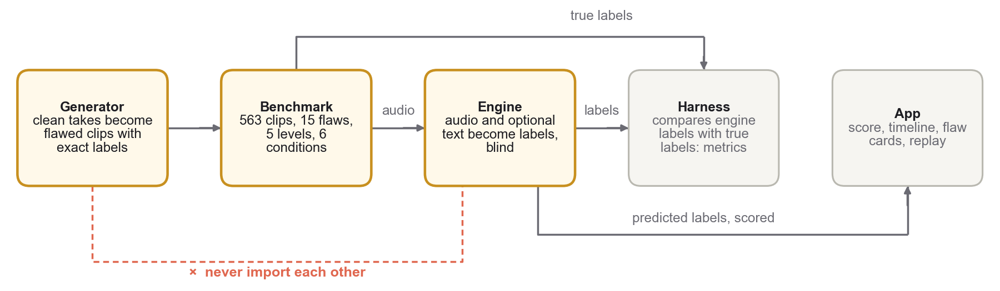
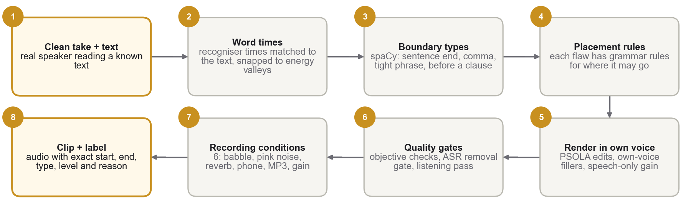
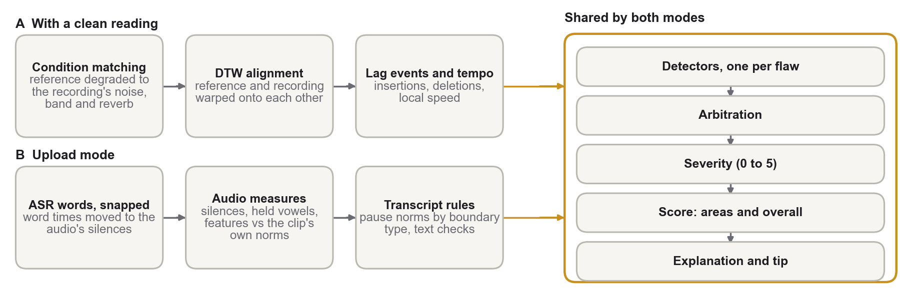

# Resonance: finding, explaining and scoring delivery flaws in speech

**Built on the Flawline benchmark.** Multimodal AI Hackathon 2026 · Track C: Contrastive Speech Analytics & Temporal Flaw Grounding.
Code, dataset and video: see the links in the README. Every number here is produced by the code in the repository; `docs/RESULTS.md` lists how each was measured.

**In one paragraph.** Feedback on spoken delivery is usually vague, and a detector cannot be validated without known answers. We built **Flawline**, a benchmark of 563 clips (about 10 hours) of real read speech in which 15 delivery flaws from 7 areas are injected at known places and five strengths, under six recording conditions, so every clip carries an exact, time-stamped label. **Resonance** finds those flaws blind, explains each one in plain words, scores seven areas and the overall delivery, and lets a speaker replay and re-record the moment. With a clean reading of the same text it reaches event F1 0.61 (train), 0.66 (held-out speaker) and 0.55 (an unseen 1962 speech); flags land a median 18 to 30 ms from the true onset and name the right area 96 to 100% of the time.

## 1. Problem and approach

A speaker practising a talk wants to know *where* delivery goes wrong and *why*, not only a single score. Human ratings are costly and inconsistent, so we build the yardstick the other way round: start from clean recordings of real speakers reading a known text, inject one flaw at a known place and strength, and keep the injection as the label. Four parts share one label format (`schema/label.schema.json`, v1.1.0): a **generator** that writes the benchmark, an **engine** that predicts the same labels blind, an **evaluation harness** that compares the two, and an **app** that shows the engine's output to a user (Figure 1). The generator and the engine never import each other, so the engine cannot read the answer from the code that wrote it.



*Figure 1. Overview. The generator turns clean takes into flawed clips with exact labels; the engine predicts labels blind; the harness scores the engine against the truth; the app shows the result to a speaker.*

## 2. What we score, and what we never score

Not every difference in a recording is the speaker's fault. We separate three axes and score only the third.

| Axis | Examples | Treatment |
|---|---|---|
| **Who you are** (identity) | accent, pronunciation habits, voice pitch and timbre, a stammer | Never scored and never injected. Measurements are normalised to the speaker's own voice; fluency scoring can be switched off. |
| **Where you recorded** (environment) | microphone, background noise, room echo, phone line, compression | Never scored. Tested by six recording conditions (Section 3.3); low-quality audio lowers confidence instead of producing guesses. |
| **What you did** (delivery) | pace, pauses, intonation, volume, fluency, clarity, text fidelity | Scored: the 15 flaws in Table 1. |

Vocabulary choice is not scored: a speaker may choose simple or rare words.

## 3. The Flawline benchmark

### 3.1 Speakers and splits

Ten baseline recordings: eight VCTK 0.92 speakers (CC BY 4.0; studio read speech; ages 18 to 38; American, New England American, English, Irish, Australian, South African and two Indian-English voices; four women, four men) and two one-minute excerpts of President Kennedy's 1962 address at Rice University (public domain; open-air recording with crowd noise). Splits hold out whole speakers: **train** B01, B02, B04, B06, B07; **dev** B03; **test** B05, B08 (run once at the end); **extra** B09, B10 (Kennedy; never used to fit anything).

### 3.2 The 15 flaws in 7 areas

Each flaw has five levels, L1 (barely noticeable) to L5 (obvious).

| Area | Flaw (code) | What a listener hears | How it is injected | Detected |
|---|---|---|---|---|
| Pacing | Rushed phrase (PACE_FAST) | a stretch spoken too fast | tempo ramps up over a short region; gaps shrink most, then vowels, consonants least | Ref |
| Pacing | Dragging (PACE_SLOW) | a stretch spoken too slowly | vowels and gaps stretched at sentence openings or before hard words | Ref |
| Pausing | Misplaced pause (PAUSE_BAD) | silence inside a phrase ("the … people") | own room-tone silence inside a tight phrase; the word before it drawn out | Ref, Up |
| Pausing | Missing pause (PAUSE_LOST) | no breath where one belongs | a pause the speaker chose (at a comma) shortened, 50 ms floor | Ref |
| Intonation | Flat pitch (MONOTONE) | a phrase with no melody | pitch range compressed where the speaker is most expressive (PSOLA) | Ref |
| Intonation | Rise on a statement (UPTALK) | a statement ending like a question | final contour replaced by a rise from the last word's nucleus | Exp, Up |
| Intonation | Buried emphasis (EMPH_FLAT) | the key word not stressed | pitch, loudness and length cues of meaning-carrying words reduced | Exp |
| Volume | Trailing off (FADE) | the sentence end fades away | gain ramp down on speech only, where breath runs out | Ref, Up |
| Volume | Sudden loud stretch (SHOUT) | a stretch much louder than the rest | vocal effort: louder, brighter and slightly higher; noise floor untouched | Ref, Up |
| Fluency | Filler (FILLER) | "uh", "um", a drawn-out word | own-voice "uh"/"um" or drawl, where people really hesitate | Ref, Up |
| Fluency | False start (REPEAT) | "the the", a restarted phrase | first attempt cut off at 60 to 80%, then a clean restart | Exp |
| Fluency | Hesitation before a hard word (RARE_HESIT) | a pause or "uh" before a rare word | pause, own-voice "uh" and a slowed rare word (Zipf < 3.5) | Exp |
| Clarity | Slurred consonants (SLUR) | mumbled, softened consonants | 2 to 8 kHz consonant energy reduced where articulation is crispest | Ref |
| Text fidelity | Skipped word (WORD_SKIP) | a small word missing | a function word removed at an energy valley, with a crossfade | Ref |
| Text fidelity | Misread word (WORD_SWAP) | a different word said | a look-alike word from the same speech (form/from), or a dropped plural -s, re-timed and pitch-matched | Ref, Up |

*Table 1. The taxonomy. Ref = detected with a clean reading of the same text; Up = also detected in upload mode (no reference); Exp = experimental, reported but excluded from headline numbers (Section 7).*

### 3.3 How a clip is made



*Figure 2. Building one labelled clip.*

1. **Word times.** A recogniser's word timestamps are matched to the known text and every cut point is moved to the nearest energy valley.
2. **Placement by grammar.** spaCy types every word boundary (sentence end, clause punctuation, before a conjunction or subordinate clause, after a discourse marker, inside a tight or loose phrase). Each flaw has placement rules, so a pause lands where no fluent reader would pause and a filler where people really hesitate.
3. **Rendering in the speaker's own voice.** PSOLA time and pitch edits reuse the speaker's own pitch periods; fillers are built from the speaker's own neutral vowels; gain changes touch speech, not the room noise.
4. **Quality gates.** Objective checks (the label sits where the audio changed, strength grows with level, edits fall on word boundaries); a removal gate (speech recognition is re-run around every removed word and the clip is rejected if the word is still heard: after three rounds, 0 of 81 removals were audible); a listening pass by one listener, after which the pace, filler, pause and slur renderers were rebuilt.
5. **Recording conditions.** Babble noise at 20 dB, pink noise at 10 dB, room reverb (RT60 0.6 s), a 300 to 3400 Hz phone band, 64 kbps MP3 and a gain change, applied to unaltered readings (the score must not move) and to a sample of flawed readings (the flags must survive).

### 3.4 The label

Every clip has a JSON label with who, where and what. Each flaw region carries its type, area, level, start and end in seconds, the words around it and the reason for its placement (abridged):

```json
{"clip_id": "B01-CHAMP_C0__PAUSE_BAD_L3_s3821",
 "where": {"base_condition": "C0", "added_condition": null},
 "what": [{"flaw": "PAUSE_BAD", "category": "Pausing", "level": 3,
           "start_s": 36.0713, "end_s": 37.0453, "boundary": "phrase_tight",
           "context": "of gold at ⟦…⟧ one end. People",
           "why": "inside a tight phrase, between 'at' and 'one'"}]}
```

### 3.5 Size and leakage check

563 clips, 9.96 hours: 405 single-flaw, 50 multi-flaw, 38 flawed clips under a recording condition, and 70 unaltered or condition-only clips. To check that flaws cannot be found from editing traces alone, a classifier that sees only artifact features (click energy at a join, noise-floor step, spectral-flux spike, exact repetition) tries to tell an altered window from the same place in the clean take: AUC 0.591 on held-out windows and 0.612 leave-one-speaker-out, where 0.5 is chance. Five flaws exceed 0.65 in the leave-one-speaker-out analysis (Section 7).

## 4. How Resonance listens

### 4.1 Features

Every recording becomes frame-level measurements (every 10 ms) and word-level facts. All acoustic measurements are relative to the speaker's own voice.

| Measurement | How it is computed | Relative to | Used for |
|---|---|---|---|
| Pitch (F0) | Praat pitch track (parselmouth), range adapted to the speaker, octave errors cleaned | semitones from the speaker's own median | flat pitch, rise on a statement, emphasis |
| Loudness | frame intensity in dB | the speaker's own median speech level | trailing off, loud stretch |
| Consonant energy | 2 to 7.5 kHz band energy relative to total energy | the speaker's own clip | slurred consonants |
| Speaking rate and timing | syllables per second over word windows; tempo from alignment with a reference | the speaker's own rate, or the reference | rushed, dragging |
| Silence and held vowels | frames below the speech floor; voiced frames with near-flat pitch and little spectral change | the clip's own noise floor | pauses, fillers, hesitations |
| Words | faster-whisper (base.en) word timestamps, aligned to the text, snapped to the audio | the text that was read | which words a moment falls between; misread or skipped words |
| Grammar and word rarity | spaCy boundary types; Zipf word frequency | fluent-reader norms | whether a pause belongs there; hesitation before a hard word |
| Spectral frames | log-mel with deltas | the reference reading | alignment (reference mode) |

### 4.2 Two ways to know what "good" is



*Figure 3. The engine. Both modes share detection, arbitration, severity, scoring and explanation.*

**With a clean reading of the same text (reference mode).** The reference is first degraded to the recording's measured bandwidth, noise and reverb, so the recording condition cannot pass for delivery. Dynamic time warping aligns the two; the lag between them is read as events (a sharp rise is an insertion such as a pause or filler, a fall is a deletion) and as tempo. One detector per flaw thresholds a speaker-normalised measurement; thresholds are fitted on train.

**Upload mode (any recording, optional text).** Expectations come from the clip's own statistics, transcript rules (pause norms by boundary type) and norms from clean speakers. Speech recognisers smooth over hesitations: they stretch words across pauses and drop "uh". So timing is taken from the audio, not from the recogniser: word times are snapped to the audio (a silence inside a word's span is handed to the word boundary), any silence of 1 s or more inside a sentence is a long hesitation, and a held, steady, flat-pitch vowel that no word explains is a filler. The words are used only to explain each moment: which words it falls between and whether a fluent reader would pause there. Five headline flaws are detectable this way; rise on a statement can also be detected but is experimental (Table 1).

### 4.3 From detection to explanation

**Arbitration** drops secondary symptoms inside a primary region (short gaps inside a rushed stretch) and resolves overlaps in favour of the more reliable detector. **Severity** maps the measured deviation to a 0 to 5 scale with an isotonic fit on train. **Explanation** fills one template per flaw with the measured numbers and the words concerned, and adds a coaching tip, for example:

> Clip `B01-CHAMP_C0__PAUSE_BAD_L3_s3821`, region 1 (36.07 to 37.04 s), found blind with a clean reading. *Explanation:* Words 96–97 "at one": 0.97 s pause inside a phrase (phrase_tight); the reference does not stop here. Misplaced pause (Pausing, severity 3.0). *Tip:* Keep phrases together; pause at commas and full stops, not between a word and its phrase. The region costs 8.5 points.

## 5. Scoring

Each flagged region costs `p = w · c · r · s² · m`: per-flaw weight `w`, recording-quality confidence `c`, detector reliability `r` (precision on train), severity `s` and duration factor `m` (1 for point events; region seconds / 2, capped at 3, for stretches). Squaring severity makes one glaring slip cost more than several mild ones. Penalties per minute `P` give each of the seven areas a score `100 · exp(−P / 35)`. The **overall score** is `0.6 × genre-weighted mean of the areas + 0.4 × weakest area`, so one bad habit cannot hide behind good ones, and the band (polished, strong, noticeable flaws, needs work) is capped by the weakest area. Area weights depend on the kind of speaking (interpretive reading, declamation, extemporaneous, persuasive oratory) and can be replaced by a user rubric. Per-flaw weights are fitted on train so that a single level-5 flaw scores about 60 for every flaw type. In a fair or poor recording, a lone flag in an area counts half and cannot become the weakest area.

## 6. The Resonance app

The app is a local web application (FastAPI service and a static front end) with three pages: Analyse, Dataset and About.

- **Upload** any recording (WAV, MP3, M4A, FLAC), with the text that was read if available, or pick an example.
- **Score**: overall score and band, plus the areas that lost points.
- **Timeline**: waveform with one feature lane at a time (pitch, loudness or rate) against the speaker's expected range, and numbered flagged regions with start and end times. This is the participant-versus-baseline overlay.
- **Flaw card**: the cause in plain words with measured numbers, the points lost, a coaching tip, and a button that plays exactly that moment.
- **Try that part again**: the user re-records just that phrase; only the measurement that caused the flag is compared, before and after.
- **Fairness switch** ("Ignore fillers and false starts") for speakers who stammer or pause to think; **downloadable report**; **Dataset page** with paired clean and flawed audio; **About page** with the evaluation numbers.


*Figure 4. The analysis view: score, flagged moments on the timeline, the cause and the points lost.*

## 7. Evaluation

**Protocol.** A predicted region matches a true flaw of the same type when their overlap (IoU) is at least 0.5 (strict) or 0.3 (standard); point events are widened to 0.30 s. We also report onset F1 (same type, start within 250 ms), the median onset error and area accuracy. Score acceptance tests check dose-response (the score must fall with level), invariance (unaltered readings under each condition keep their score and raise at most 0.5 false flags per minute) and locality (a flaw should cost points mainly in its own area). Everything is fitted on train, checked on dev; the Kennedy set is never fitted on; the test split is run once.

| Reference mode | Clips | F1 (IoU ≥ 0.5) | F1 (IoU ≥ 0.3) | Onset F1 | Median onset error | Area accuracy |
|---|---|---|---|---|---|---|
| Train | 235 | 0.611 | 0.670 | 0.580 | 17.5 ms | 98% |
| Dev (held-out speaker) | 20 | 0.659 | 0.729 | 0.541 | 29.5 ms | 100% |
| Kennedy 1962 (unseen) | 160 | 0.551 | 0.607 | 0.528 | 26.1 ms | 96% |
| Test (B05, B08) | run on 12 Oct | | | | | |

*Table 2. Eleven headline flaws.* In upload mode (five detectable flaws) strict F1 is 0.363 on train, 0.412 on dev (7 of 23 flaws found) and 0.116 on Kennedy 1962, where recogniser errors on the noisy recording produce many false flags.

 

*Figure 5. Left: per-flaw event F1 on train, reference mode and upload mode. Right: overall score against flaw level; one line per scored flaw.*

**Acceptance tests.** The score falls steadily with level for 12 of 13 scored flaws (hesitation before a hard word fails, ρ = −0.64). Under the six conditions, unaltered readings raise 0.45 false flags per minute (target ≤ 0.5, met); the mean score shift is 0.0 to 1.6 points per condition and the worst case is 6.5 points (target < 3, not met). A level-3 flaw costs 6.1 points in other areas on average (target < 2, not met). **Experimental flaws:** buried emphasis (F1 0.08; the voices are too flat for flattening to scale with level), false starts (0.07), rise on a statement (0.22) and hesitation before a hard word (0.63, but non-monotone and leakage AUC about 0.7). **Leakage:** FILLER (0.69), PAUSE_BAD (0.71), PAUSE_LOST (0.72), RARE_HESIT (0.72) and REPEAT (0.74) exceed 0.65 leave-one-speaker-out, so part of their detectability may come from editing traces.

## 8. Limitations

Upload mode is weaker than reference mode and does not transfer to noisy archival speech; skipped words need a clean reading. Four flaws are experimental, and two acceptance targets (worst-case score shift, locality) are not met. The speaker pool is small: eight studio voices aged 18 to 38 plus one 1962 speaker, read speech only, so no claim is made about accents, ages or spontaneous speech. Realism of the injected flaws was checked by one listener. The dev split is a single speaker, so its numbers are noisy.

## 9. Future work

A gold set of real speeches labelled by debate coaches, to tune and test on human judgement (the labelling and review tools, `make label` and `make review`, and the engine-versus-listener comparison script are already built); coaching text from a language model grounded in the measured numbers; Indian English and code-mixed speech; and a reference-free route to skipped words.

## 10. Reproducing, and where each requirement is met

`make setup`, unzip the released dataset into `flawline-dataset/` (or rebuild with `make baselines dataset`), `make eval`, `make app`. Docker, the pinned `requirements.lock` and SHA-256 checksums for every clip are in the repository.

| Track C requirement | Where |
|---|---|
| Custom contrastive dataset, publicly available | Flawline benchmark (Section 3), `DATASHEET.md`, download link in the README |
| Same transcripts for baseline and flawed versions | every flawed clip is derived from its own baseline take (Section 3.3) |
| Temporally bounded labels | `schema/label.schema.json`, Section 3.4 |
| Speaker-agnostic, stress-tested under recording conditions | Sections 2, 4.1 and 7 |
| Feature extraction | Section 4.1, `engine/features.py` |
| Flaw regions with causal explanations | Sections 4.3 and 6 |
| Dashboard: upload, feature extraction, overlay, flaw regions | Section 6, `app/` |
| Reproducibility | Makefile, Dockerfile, `requirements.lock`, checksums |
